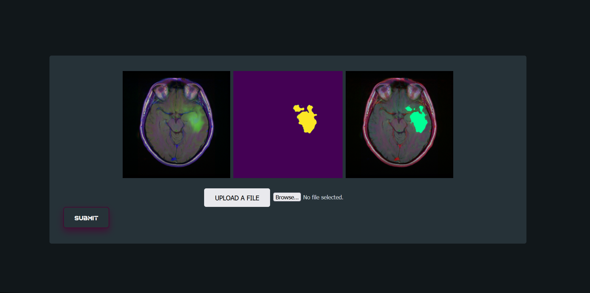
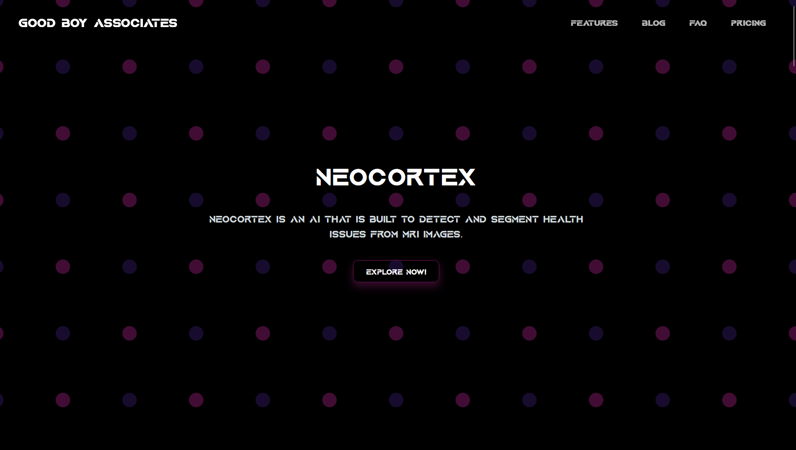
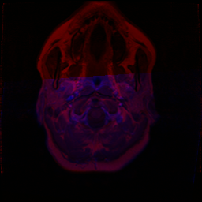
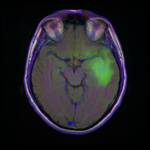
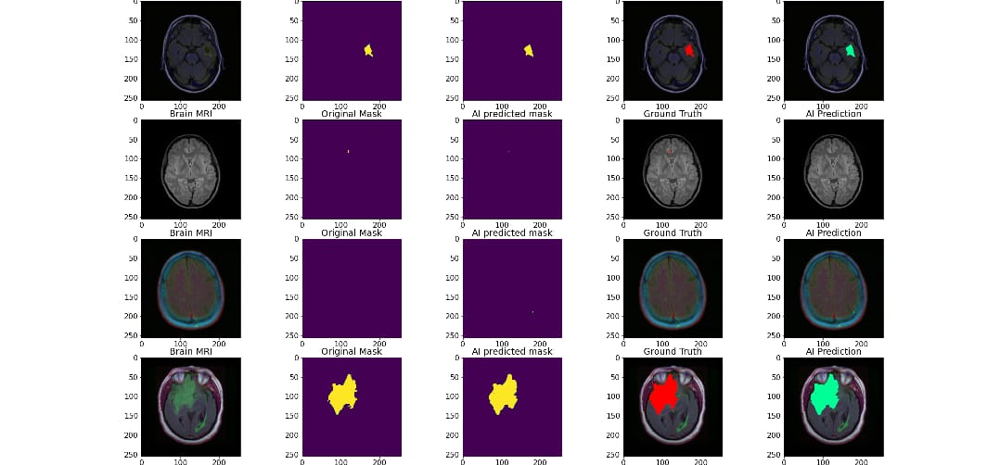

# NeoCortex 

## Problem Identified 
Brain tumors are one of the leading causes of death worldwide, and early and accurate diagnosis is crucial for improving patient outcomes. However, the current diagnostic methods for brain tumors are time-consuming, costly, and often unreliable. This leads to delayed treatment and can have a significant impact on patient health and well-being.
 

## Solution
Developing a solution to detect and segment brain tumors from MRI scans is a valuable project that could have a significant impact on the healthcare industry. This type of solution could potentially improve the accuracy and speed of brain tumor diagnosis and treatment planning, helping medical professionals provide better care for patients.the early detection and treatment of brain tumors. Additionally, you could highlight the innovative use of technology and AI to tackle this issue, aligning with the focus of the hackathon on promoting technology-based solutions for health challenges.
 

## Project Description 
NeoCortex is an AI solution that utilizes the latest deep learning techniques such as Resnet and ResUnet to segment and detect brain tumors from MRI images. The system is trained on a large dataset of 10,000 images, allowing it to accurately analyze MRI scans and detect the presence of brain tumors with high accuracy. By eliminating the subjectivity and human error associated with manual diagnosis, NeoCortex provides a reliable and cost-effective solution for the early detection of brain tumors.
 

## Team members

1. [Rohith K Bobby](https://github.com/Rohith04MVK)
2. [Sharon Aliyas Johnson](https://github.com/SharonAliyas5573)
3. [R S Sacheth](https://github.com/r-s-sacheth)
4. [George C Thomas](https://github.com/george-ct52)

<!-- ## Link to product walkthrough
 -->
## How it Works ?
NeoCortex is an AI project that uses deep learning techniques to detect and segment brain tumors from MRI images. The AI system uses two different techniques to achieve this goal - ResNet for the identification of brain tumors and ResUnet for the segmentation of the tumors from the surrounding tissue. \
ResNet (Residual Network) is a deep learning architecture that is trained on a large dataset of MRI images. The network uses multiple layers of neural networks to identify the features and patterns in the MRI images that are indicative of brain tumors. By using these features, ResNet can accurately predict the presence of brain tumors in new MRI scans. \
ResUnet, on the other hand, is used for the segmentation of brain tumors from the surrounding tissue. ResUnet uses a combination of convolutional and deconvolutional neural networks to separate the brain tissue from the tumor. The network is trained to identify the boundaries of the tumor and create a 3D representation of the tumor, making it easier to visualize the extent of the disease.\
Once ResNet and ResUnet have been trained on the dataset of MRI images, they can be used together to detect and segment brain tumors in real-time. The system starts by using ResNet to identify the presence of brain tumors in a new MRI scan. If a tumor is detected, ResUnet is then used to segment the tumor from the surrounding tissue and create a 3D representation of the tumor.\
In conclusion, NeoCortex is a highly effective and reliable AI system for the detection and segmentation of brain tumors from MRI images. By using deep learning techniques such as ResNet and ResUnet, NeoCortex provides an accurate and efficient solution for the early detection of this life-threatening disease.

## Photos of the Project

## Libraries used
1. [Numpy](https://numpy.org/)
2. [Tensorflow](https://pypi.org/project/tensorflow/)
3. [Scikit](https://pandas.pydata.org/)

